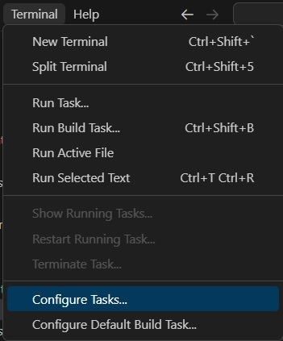

# Spaceship operator.

## Introduces space ship operator.
1. Also called as Three way comparision operator.

## How this example is built
1. Create a file called main.cpp
2. Add the code as is in the file.
3. Then in vs code, Terminal -> Configure Tasks.

    

4. 

## References
1. https://en.wikipedia.org/wiki/Three-way_comparison
2. https://www.geeksforgeeks.org/3-way-comparison-operator-space-ship-operator-in-c-20/
3. https://devblogs.microsoft.com/cppblog/simplify-your-code-with-rocket-science-c20s-spaceship-operator/
4. https://youtu.be/8jLOx1hD3_o?t=1816
