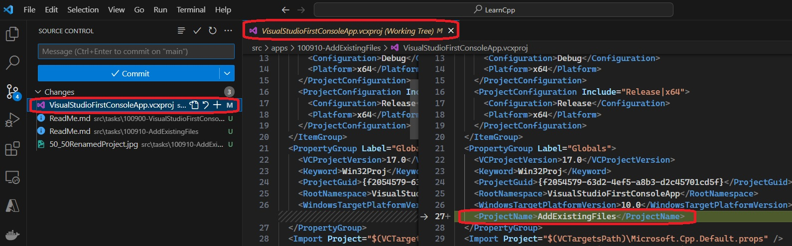

## Notes
1. Rename a project using Visual Studio. Solution Explorer -> Right click Project -> Rename.
2. The following happens to the project file after renaming. Note the file itself is not renamed. Only a tag is added.

    

3. 