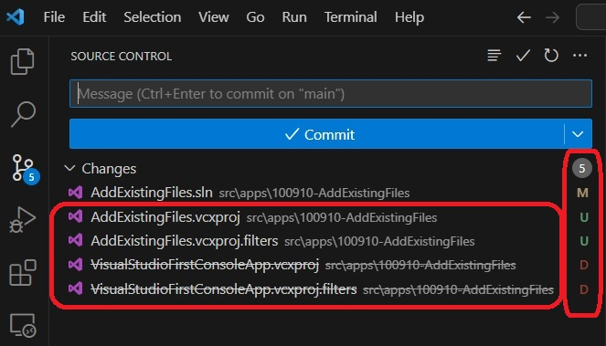

## Notes
1. Rename a project using Visual Studio. Solution Explorer -> Right click Project -> Rename.
2. The following happens to the project file after renaming. Note the file itself is not renamed. Only a tag is added.

    

3. When you rename a project file(.vcxproj), you need to rename the (.vcxproj.filters) file as well.

    

4. Take a look at this to understand filters file. 
   1. https://stackoverflow.com/q/1826901/1977871

5. 

6. 