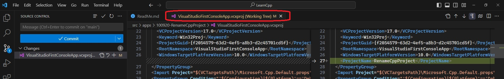

# Demos Renaming of Project steps.

## Steps
1. After copying, rename the solution file.
2. Next is to rename the project. Rename the project using Visual Studio. Solution Explorer -> Right click Project -> Rename.
3. The following happens to the project file after renaming. Note the file itself is not renamed. Only a tag is added.

    