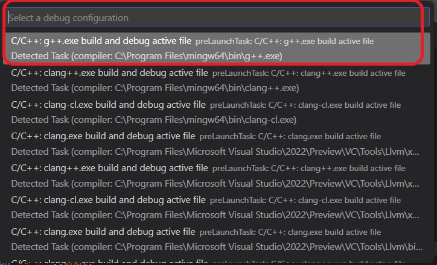
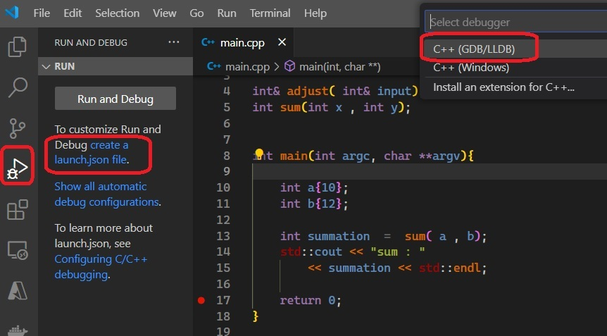
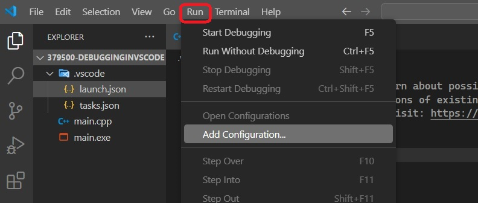
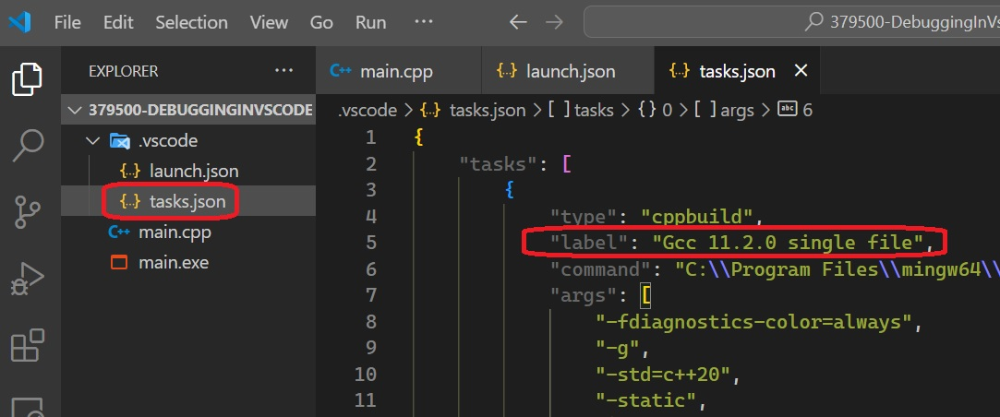

# Auto

## Notes
1. First ensure the .vscode folder is empty, so we start from scratch. Note here below .vscode filder is empty. 


2. Setup Run/Debug configurations in launch.json files. Ensure the following extension. Go to that extension and Click the link as follows. 


3. You will be taken to the following link.

https://code.visualstudio.com/docs/cpp/config-mingw

4. Then scroll down to the following link

https://code.visualstudio.com/docs/cpp/config-mingw#_debug-helloworldcpp


5. Open the file in Vs Code as follows, and then press the play button in the top right corner of the editor.


6. Select Gcc as follows.



7. This generates a Task.json file. Add the following to the task args

```json
    "-std=c++20",
	"-static",
```


8. Take a look at the following reference

https://code.visualstudio.com/docs/cpp/config-mingw#_understanding-tasksjson

9. Now adding launch.json file. Go to the following reference.

https://code.visualstudio.com/docs/cpp/config-mingw#_customize-debugging-with-launchjson

10. Do the following to add launch.json file



11. This adds a launch config file as follows.


12. Place the cursor in between the square brackets(look below) and press Ctrl + Spacebar to kick the intellisence. 

```json
{
    // Use IntelliSense to learn about possible attributes.
    // Hover to view descriptions of existing attributes.
    // For more information, visit: https://go.microsoft.com/fwlink/?linkid=830387
    "version": "0.2.0",
    "configurations": []
}
```

13. Or Or Run -> Add Configuration.



14. You will see the following. Choose Launch config as follows.

 

15. Then edit it to add the path etc.

16. Take a look at `preLaunchTask` for each configuration in launch.json file. 

 

17. Now take a look in `label` in Task.json

 

18. Note both the above should match, the `label` and `preLaunchTask`.   

19. Now to actually debug. Ensure main.cpp is selected and open in the window. Then select the debug tab. 


20. Press Play button.


21. You can now see the call stack and watch window as follows.


## References

1. https://go.microsoft.com/fwlink/?linkid=830387
2. https://code.visualstudio.com/docs/cpp/config-mingw#_understanding-tasksjson
3. https://code.visualstudio.com/docs/cpp/config-mingw#_debug-helloworldcpp
4. https://code.visualstudio.com/docs/cpp/config-mingw#_customize-debugging-with-launchjson

