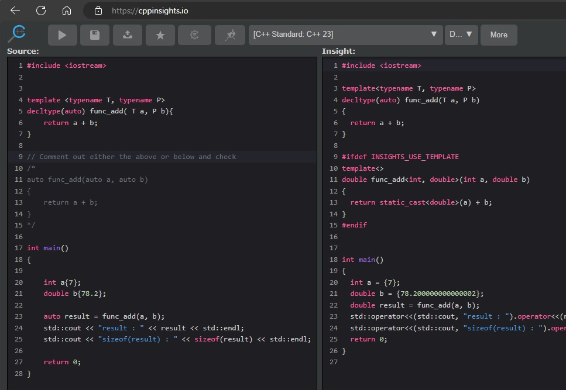

# Auto

## Notes
1. When the compiler sees a functioni with auto, it will generate a template as follows.


```cpp
auto func_add(auto a, auto b)
{
    return a + b;
}
```

```cpp
template <typename T, typename P>
decltype(auto) func_add( T a, P b){
    return a + b;
}
```

3. Go to cppinsights.io and check.

4. Cpp Insights.



## References

1. 

