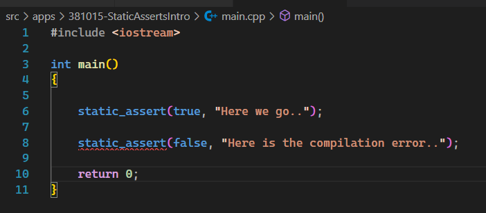

# Auto

## Notes
1. Introduces `static_assert`

```cpp
.\main.cpp: In function 'int main()':
.\main.cpp:8:19: error: static assertion failed: Here is the compilation error..
    8 |     static_assert(false, "Here is the compilation error..");
      |                   ^~~~~
```



2. 


## References

1. https://en.cppreference.com/w/cpp/header/type_traits
2. https://en.cppreference.com/w/cpp/language/static_assert

