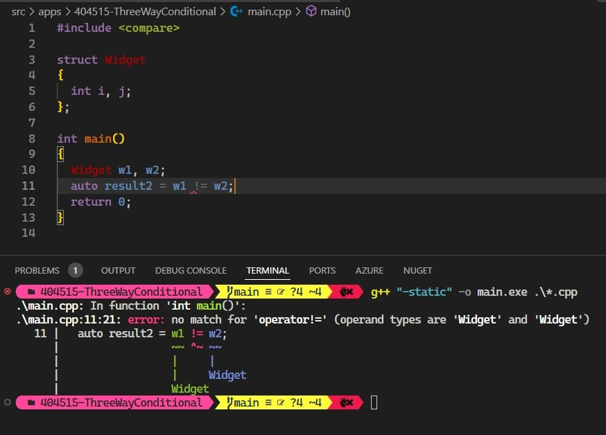

# Auto

## Notes
1. Spaceship operator <=>. This is also called as three way conditional. 

2. You need to import <compare>

3. If a type a needs to be compariable, we need to introduce some kind of ordering between various instances. 

4. Lets say we have a type defined as follows.

```cpp
struct Widget
{
  int i, j;
};
```

5. Now lets say we want to compare two instances of such a type as follows.

```cpp
int main()
{
  Widget w1, w2;
  auto result2 = w1 != w2;
  return 0;
}
```

6. If you compile the above, you get an error like the following.

```txt
.\main.cpp: In function 'int main()':
.\main.cpp:11:21: error: no match for 'operator!=' (operand types are 'Widget' and 'Widget')
   11 |   auto result2 = w1 != w2;
      |                  ~~ ^~ ~~
      |                  |     |
      |                  |     Widget
      |                  Widget
```



7. Inorder to address that, we need to define != operator like the following. 

```cpp
bool operator!=(const Widget &a, const Widget &b)
{
  return !(a.i == b.i && a.j == b.j);
}
```

8. Or may be like the following.

```cpp
bool operator==(const Widget &a, const Widget &b)
{
  return a.i == b.i && a.j == b.j;
}

bool operator!=(const Widget &a, const Widget &b)
{
  return !(a == b);
}
```

9. Now it will compile. 

10. So thats just for the != operator. If we want other comparisions to work, we need to define all other operators as well. This can be very tedious. 

11. So cpp 20 offers <=>, its called three way comparision operator. So do the following. Add a <=> operator as follows.

```cpp
#include <compare>

struct Widget
{
  int i, j;
  auto operator <=> (const Widget &) const = default;
};

int main()
{
  Widget w1, w2;
  auto result2 = w1 != w2;
  return 0;
}
```

12. Because of that one line `auto operator <=> (const Widget &) const = default;`, the complier will generate all of the rest of the required operators.

13. That one line will create a default implimentation. For a given type, that default one may not be the one that we want, and so we can define our own custom implimentation. 


## References

1. https://www.youtube.com/watch?v=dGYBCXLWOzo

