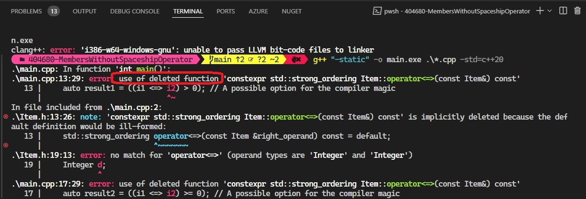

# Auto

## Notes
1. We want to setup a 3 way comparision operator for your type, but your type happens to have members that dont implement the three way comparision operator themselves. 

2. The following two operators are from Integer class. If these are commented out, then we get a compiler error.
```cpp
bool operator==(const Integer &right) const
{
    return (m_wraped_int == right.m_wraped_int);
}
bool operator<(const Integer &right) const
{
    return (m_wraped_int < right.m_wraped_int);
}
```
3. The Item type has a member whose type is Integer class. 
4. The three way comparision operator on the item class. The compiler cannot compile the Item class. This is because the compiler can handle int types, but not the Integer class. The compioer does not have any idea how to compare integer objects. 

```cpp
int a{1};
int b{2};
int c{3};
Integer d;
```

5. So the three way comparision operator that is present in the Item class will be deleted by the compiler becuase it cannot use it. 



6. Now uncomment the above from the Integer class. Then inlcude the following in the item class.

```cpp
auto operator<=>(const Item &right_operand) const = default;
// std::strong_ordering operator<=>(const Item &right_operand) const = default;
```

This will again give error. This is beacuse,
first, the integer still does not have three way comparision opertor. And the compiler does not know what kind of comparision we want to do with the item class, strong, weak or partial.

So we need to do this instead of the above. So here now, the return type is not auto, but std::strong_ordering. 

```cpp
// auto operator<=>(const Item &right_operand) const = default;
std::strong_ordering operator<=>(const Item &right_operand) const = default;
```

7. 

## References

1. 

