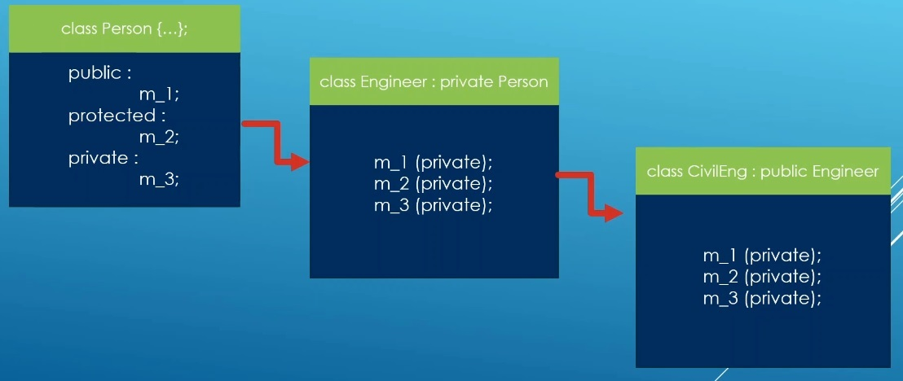

# Auto

## Notes
1. Say we have the following hierarchy.



2. So m_1, m_2 and m_3 will remain private to Engineer class. So now CivilEng class will not have access to any of those three. 

3. But lets say m_1, m_2 need to be accessed by grand children or the inherited classes.

4. C++ is weired. It gives a back door entry in this case.

5. You need to use the `using` keyword as follows.

```cpp
public : 
    using Person::add; // This is going to resurrect all of the overloads of add method.

protected : 
    using Person::get_full_name;
    using Person::get_age;
    using Person::get_address;
    //using Person::m_address; // Compiler error. This is because m_address is private in the base class which is person.

int get_contract_count() const{
    return contract_count;
}
```

6. What we have done above is to resurrect those members. 
7. This is all something that is to be avoided, this only make things complicated, hard and difficult to purse. 

## References

1. 

