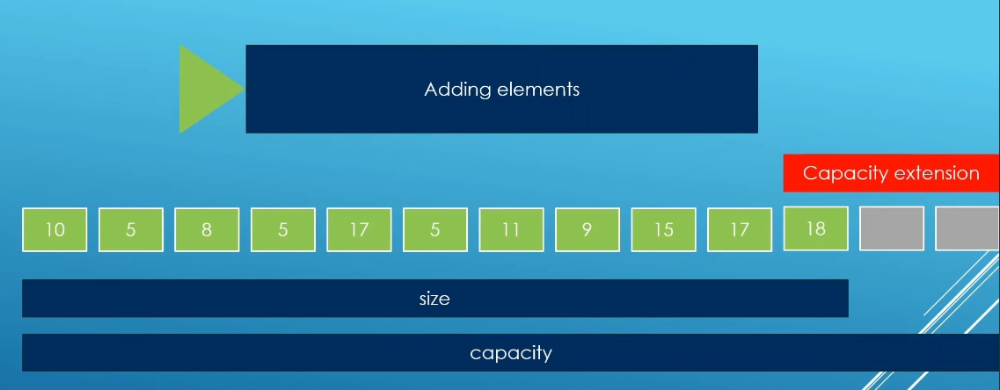

# Auto

## Notes
1. Expand, is to increase the capicity. 


2. See the expand method in te boxcontainer.cpp file. We first create anew array of a larger size. Then discard the old array of the smaller size. An array is a fixed size container. 

```cpp
value_type *new_items_container;
```

3. 

## References

1. 

