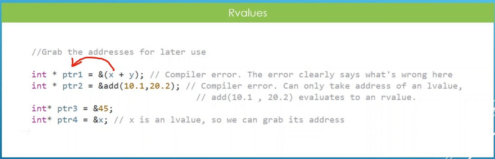

# Auto

## Notes
1. The move semantics are a bunch of features that really make up a mechanism we have in cpp, to avoid throwing those temp objects, that might contain the data we need. The move semantics can help us avoid unnecessary copies.

2. Move semantics are all about stealing data from temporaries.
3. Introduced in cpp 11.

4. LValues are things you can grab an address for and use at a later time. Things you can store in memory in long term basis. 

5. RValues are transient or temporary in nature, they only exist for a short time, and are quickly destroyed by the system when no longer needed. 

6. 

## References

1. 

