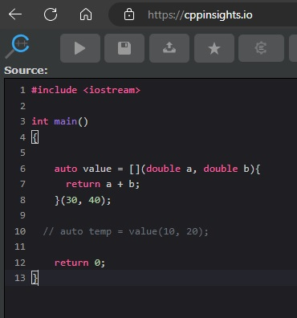

# Auto

## Notes
1. When a compiler sees a lambda, it will generate a functor behind the seans.

2. Take a look at [cppinsights.io](https://cppinsights.io/) as follows.



3. Paste the following 

```cpp
#include <iostream>

int main()
{
	auto value = [](double a, double b){
      return a + b;
    };
    
    auto temp = value(10, 20);
  
    return 0;
}
```

Lambda functions are powered by functors behind the seans.

## References

1. 

