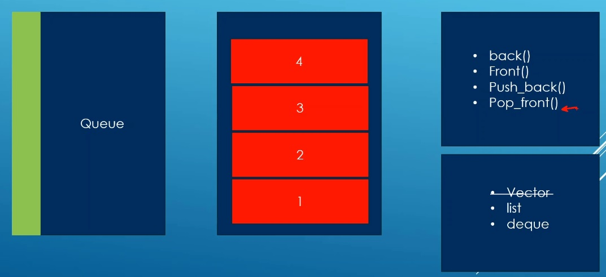

# Auto

## Notes
1. std::queue is a container that works in a First in First out fashion. 
2. The first item in is the first item to get out.
3. It is an adaptation on top of existing sequence containers that support the features below:
   1. back(): To get the last item.
   2. front(): to get the first item.
   3. push_back(): to add new items to the bakc of the container.
   4. pop_front(): to remove the first item.
4. These methos are enough to supporlt FIFO semantics. std::deque and std::list are our options and std::dqueue is the default. Std::vector is ruled out because it has no pop_fron() like method.

## References

1. https://en.cppreference.com/w/cpp/container/queue

