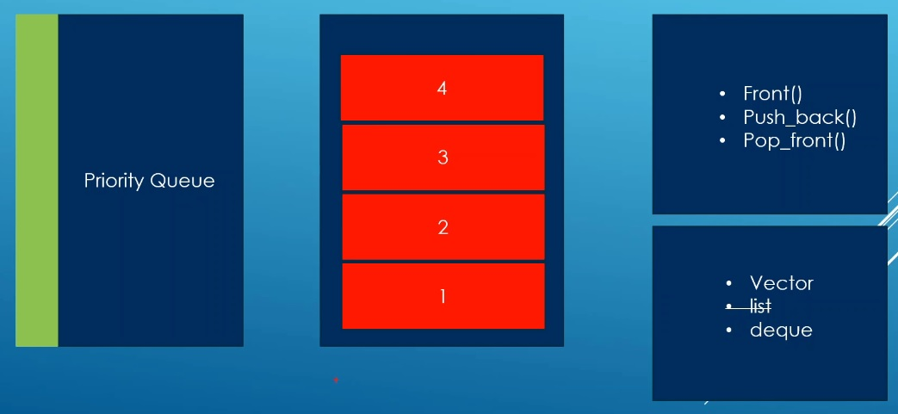

# Auto

## Notes
1. This works like a queue, but the elements are ordered and given priorities. The element with higher priorities will go at the end. 



2.  The less than operator is necessary for priority queue container to work. Comment out the following, compile and see. You will get a compiler errro.

```cpp
bool operator<(const Book &right_operand) const
{
    return this->m_year < right_operand.m_year; // original prioriy: bigger year comes to the top.
}
```

3. You can also specify a lambda or a functor. 

## References

1. 

