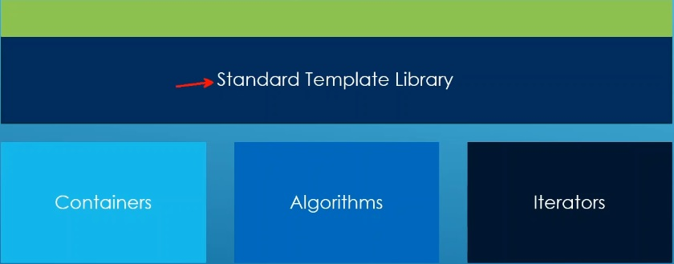

# Auto

## Notes
1. Algos are the last piece of the puzzle in the STL. 

2. Algos are a set of functions that work on containers using iterators to do many different things.

3. Two types of Algos

   1. Legacy algorithms. Work on iterator pairs. Here we use a pair of iterators, begin and end, 

   2. Range Algorithms. Work on containers directly. Here we dont have to specify the begin and end of the iterator. 

## References

1. https://en.cppreference.com/w/cpp/algorithm
2. 

