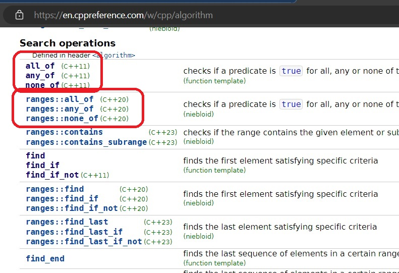

# Auto

## Notes
1. Big feature of cpp 20.
2. The features in Range library will make your code easy to work with. 
3. The features are as follows.
   1. Range Algorithms: Range algos are a bunch that work without you needing to use begin() and end() iterators.
   2. Projections: Streamline how your algos work, on aggrigated data types.
   3. Views and view aldaptors: They are going to give a changed view on the underlying container. Say, you have a collection of ints, and you want only to maipulate even numbers from that collection, then views from the ranges library make that very easy.
   4. Function composition: 
   5. Range factories: 
4. Every regular algos we seen earlier have a ranges couter part. Look at https://en.cppreference.com/w/cpp/algorithm

5. Two types of Algos

   1. Legacy algorithms. Work on iterator pairs. Here we use a pair of iterators, begin and end, 

   2. Range Algorithms. Work on containers directly. Here we dont have to specify the begin and end of the iterator. 

## References

1. 

