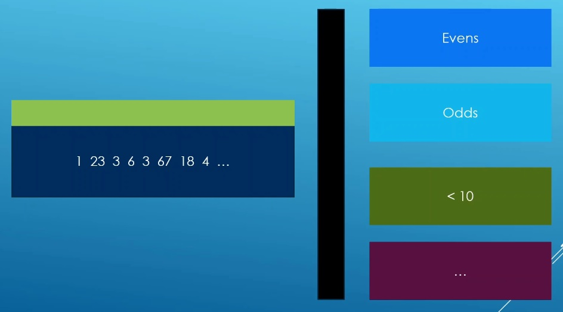

# Auto

## Notes
1. A view is simply a range. Non owning range
2. Its like a whindow we can set up to view some real data without setting up the infrastructure to store data.
3. Views are cheap to copy and pass around as function parameters by design. 
4. A subset of range. Others are eclipsed. Its like a filter. 
5. Views are ranges that allow us to view data in our container in a differnet way



6. The following is what you get when you pass in a predicate to a `transform_view`. So a predicate cannot be passed to a `transform_view`

```cpp 
auto evens = [](int i)
{
    return (i % 2) == 0;
};
std::ranges::transform_view v_transformed_evens = std::ranges::transform_view(vi, evens);
print(v_transformed_evens);
```

```txt
0 1 0 1 0 1 0 1 0
```

7. 

## References

1. https://en.cppreference.com/w/cpp/ranges
2. https://en.cppreference.com/w/cpp/ranges/filter_view

