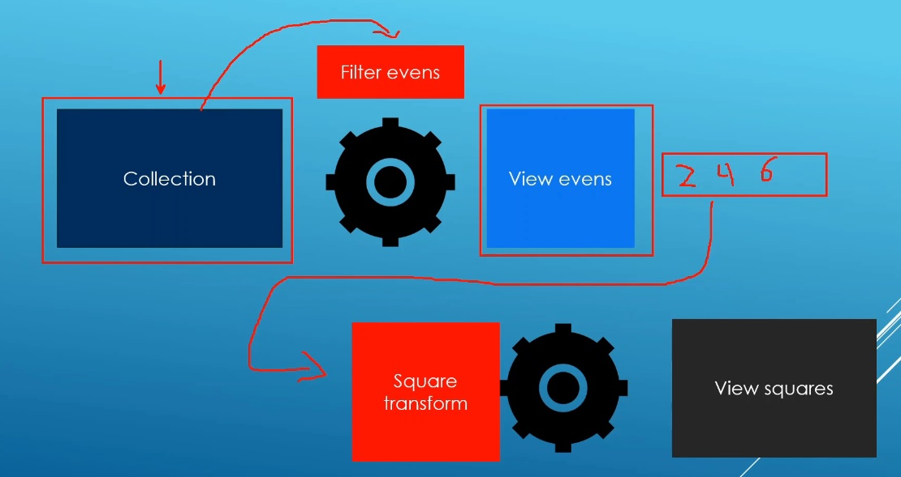

# Auto

## Notes
1. Taking data from one view and passing it on to another view.



```cpp
auto my_view = std::views::transform(std::views::filter(vi, even), [](auto n) { return n *= n; });
```

2. This is called view composition or function composition.

3. The pipe operator is syntatic sugar on top of view/function composition.

4. `std::views::reverse`. The reverse view does not work on un ordered collections, like unordered map.

```cpp
std::unordered_map<std::string,unsigned int> classroom    
```

5. 

6. `std::ranges::copy`. This is for copying into outputstream on the fly

```cpp
std::ranges::copy(numbers, std::ostream_iterator<int>(std::cout, " "));
```

## References

1. https://en.cppreference.com/w/cpp/algorithm/ranges/copy

