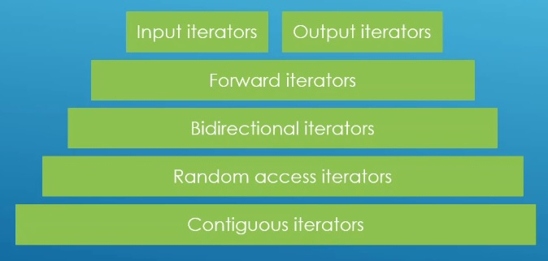

# Auto

## Notes
1. We have played with stl slgorithms for quite a while now, and seen the benifits of built in stl containers.
2. Interators are the glue that ties containers and algorithms together.
3. Containers have to provide iterators, and alogrithms are going to be looking for those iterators to work on those containers in a unified way. 
4. Sometime, you want your own container to be able to work with built in stl alogrithms, like std::sort, std::find, std::fill.
5. This opens a new world of flexibility for your container.
6. We want BoxContainer to support interators, so what it can use range based for loops for example, and be usable with stl agorithms. 
7. What if we want our own containers to plug into the cpp standard library and use the already existing alogirithms to manipulate the data. 
8. A range based for loops use iterators behind the scenes. And if your containers do not provide the needed iterators, range based for loops are not going to work. 
9. Iterator Types
   1. Input iterators
   2. Ouput iterators
   3. Forward iterator
   4. BiDirectional Iterator
   5. Random Access Iterator
   6. Contiguous Iterator
10. Iterators types are hierarchical.
   1.  A forward iterators is also an input iterator, a bidirectional iterator is also a forward iterator, a random access iterator is also a bidirectional iterator. 
   2.  So its like this.
       1.  Input Iterator, Output Iterators.
       2.  Forward Iterator.
       3.  Bidiretional Iterator.
       4.  Random Access Iterator.
       5.  Contiguous Iterators
   3.  A alogirthm that works for bidirectional iterator should also work with forward iterator.
   4.  A alogirthm that works for random access iterator should also work with bidirectional iterator. 

11. Here it is.

 

11. Some algorithms needs specific iterators. See the following table.

| Sl. No.   | Algorithm     | Price                     |
| :-----:   | :------       | ----:                     |
| 1.        |std::find()    | Input iterator            |
| 2.        |std::fill()    | Forward iterator          |
| 3.        |std::reverse() | Bidirectional iterator    |
| 4.        |std::find()    | Random Access iterator    |

## References

1. https://en.cppreference.com/w/cpp/algorithm/ranges/find
2. https://www.youtube.com/watch?v=fdwoXjIg94k
3. https://internalpointers.com/post/writing-custom-iterators-modern-cpp
4. https://www.fluentcpp.com/2018/04/27/tag-dispatching/
5. 

