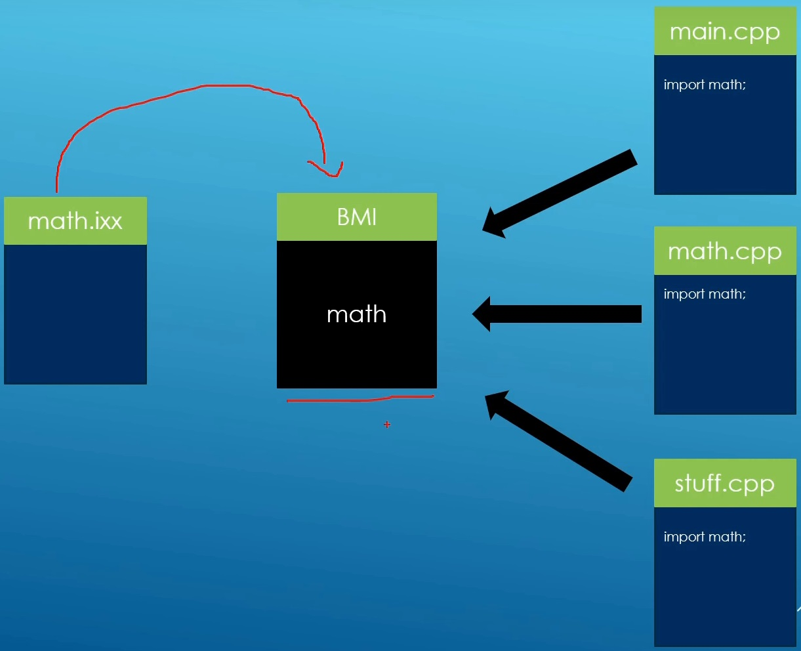
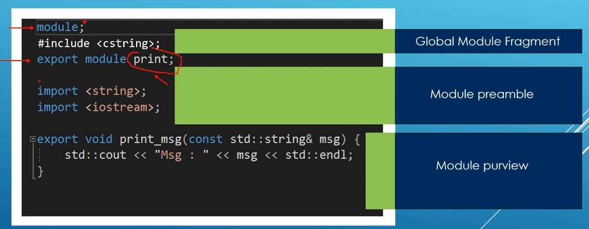

# Auto

## Notes
1. One of the big cpp 20 features.

2. Changes the compilation model of cpp programs.

3. They provide a chlear way to control which declarations are exported to client and which ones are encapsulated as implementation details.

4. The header based compilations have a few problems.
   1. Compilation speed.
   2. ODR violations
   3. Include order. Included files can change the behavior of the program.
   4. Headers dont offer encapsulation out of the box.

5. A module file not processed multiple times.

6. Compilation speed improved by BMI
7. ODR violations. None. BMI lives in one object file.
8. Include order. Doesnot matter. Modules available in some pre compiled form in the BMI file.
9. Declarations are wel encapsulated and names need o be explicitly exported. 

10. Global Module Fragment
    1.  Can only contain pre processor directives
    2.  Allows old style #include'ing headers in a module.
    3.  #include statements can only show up in the global module fragment, if you put them else where, you will get weird errors.

11. Module preamble
    1.  Should only contain import statements. May be inporting proper module files, or just plain old non C-library headers(header units)
12. Module purview
    1.  Contains the code fo the module; functions, type, etc. that make up the interface of the module.
    2.  Some entities are exported, making them visible outside the module.
    3.  Those not exported are only usable inside the module itself
    4.  Because of this, modules have good enacpsulation for declarations out of the box.  

13. Some facts.
    1.  Each module is compiled independently into an object file.
    2.  Modules must be compiled in an order in such a way that call the dependencies are compiled first.
    3.  If you are compiling manually on the command line your sef, you have to take care of this order yourself.
    4.  In practice however, IDEs and build systems will figure out this order automatically. 

14. Module file extension(Visual c++)
    1.  Module files(.ixx)
    2.  BMI(.ifc)
    3.  Implementation files(.cpp)

15. Module file extension for GCC
    1.  Module files - No specfific extension. sometimes .cc extension is used.
    2.  Implementation files(.cpp)

16. Module file extension(Clang)
    1.  Module files(cppm)
    2.  Implementation files(.cpp)
    3.  BMI(.pcm)

17. We will be using the following
    1.  Module files(.ixx)
    2.  Implementation files(.cpp)
    3.  We will pass special compiler optionis to g++ and clang++ to tell them to treat .ixx files as module files.
    4.  This will allow us to compile the same source code on all compilers
18. Header units
    1.  The need to use old style headers(iostream, vercotr..) as modules.
    2.  They are part of an effort to make it easy to port old code to modules.
    3.  The compiler compiles the header into a form where it can be treated like a modules. 
    4.  The compiler compiles the header into a form where it can be treated like a module.
    5.  They are like pre-compiled headers, a feature available for a long time in most compilers. 
    6.  We will stive to use headers units like import <iostrea>, import<vercotr> wehre we can.
    7.  Support differs across compilers thought. From our experiments, clang has the worst support so far.
    8.  Where needed, we will revert back to including the old way in the global module fragment. 
19. Compilers
    1.  GCC
    2.  Clang
    3.  Visual CPP
20. Clang Docker
    1.  The docs:
        1.  https://clang.llvm.org/docs/StandardCPlusPlusModules.html
    2.  The docker image
        1.  https://hub.docker.com/r/teeks99/clang-ubuntu/tags
    3.  Visual CPP
21. Clang - Docker
    1.  Flow:
        1.  ACTION: Install the docker engine on your system.
        2.  PULL: docker pull teeks99/clang-ubuntu:18
        3.  ACTION: Change to the D:/Snadbox folder on your windows machine.
        4.  RUN: docker container run --name clanghank -it -v ${PWD}:/home/gakwaya teeks99/clang-ubuntu:18
        5.  ACTION: Attach to the container to a terminal and have fun.
    2.  Important: 
        1.  Clang seems to expect that the name of the generated PCM file be the same as the exported modules.
        2.  Keep this in mind. Luckily it supports flags that allow us to keep naming our interface files with the .ixx extension. The flag is -x c++module. See example below.
        3.  

22. I faced the following problems while starting docker desktop on windows 11. It does not start.
    1.  So did the following.
    2.  Ran the command. `wsl -l`
        1.  Windows Subsystem for Linux Distributions:
        2.  docker-desktop-data (Default)
        3.  docker-desktop
    3.  See [this supre user answer](https://superuser.com/a/1758362/674525)
    4.  wsl --unregister docker-desktop
    5.  wsl --unregister docker-desktop-data
    6.  Also stopped docker desktop and removed the following file, and so when I restarted the docker desktop, the file was recreated; addressing the possibility of its corruption
        1.  C:\Users\YourUserName\AppData\Roaming\Docker\settings.json 
    7.  

## References

1. 

