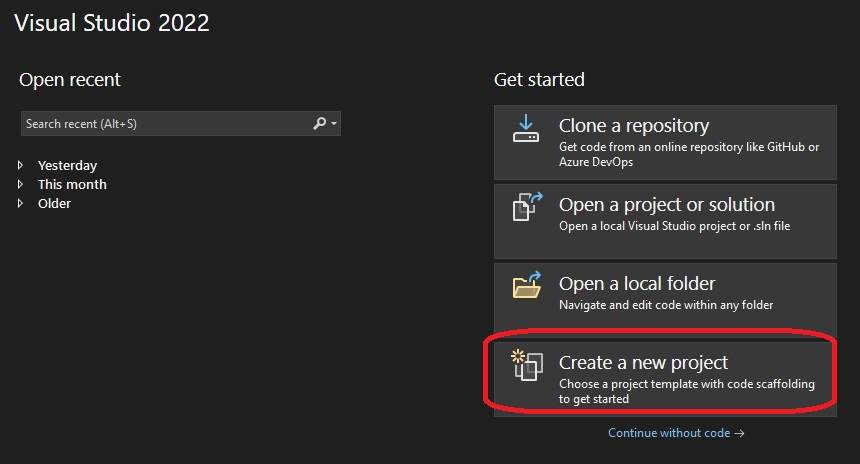
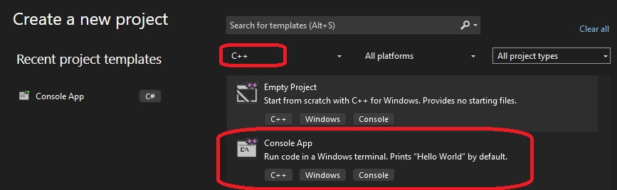
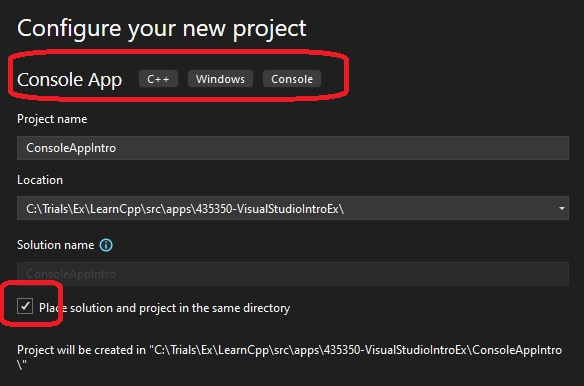
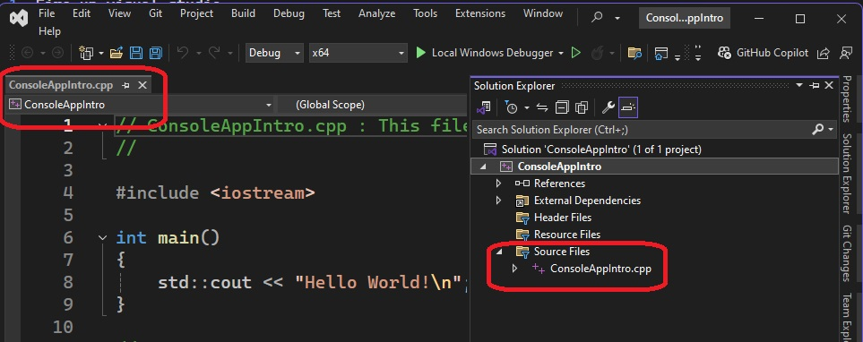
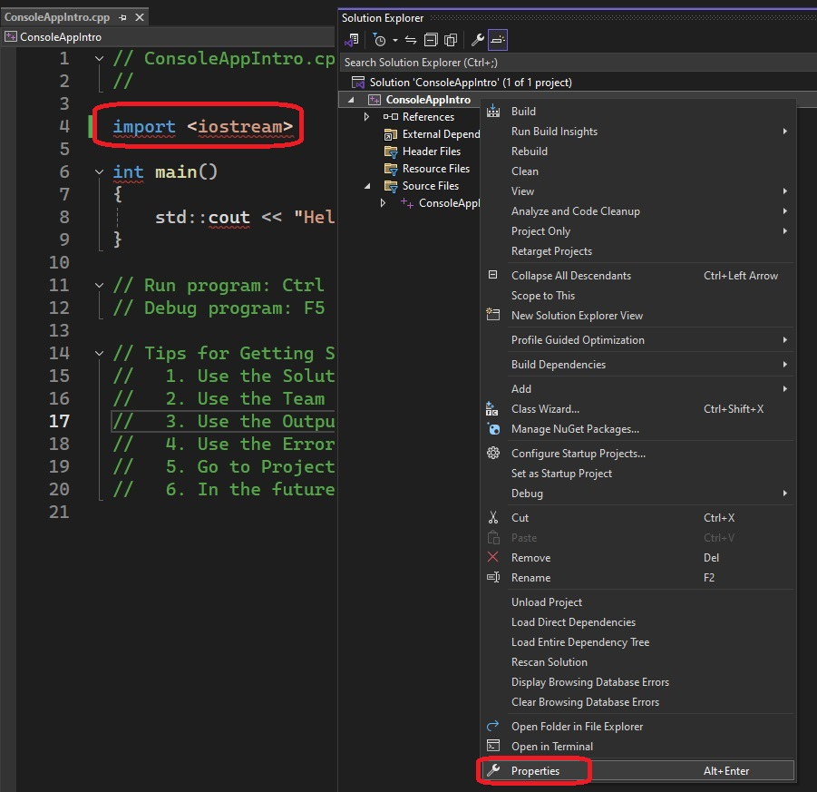
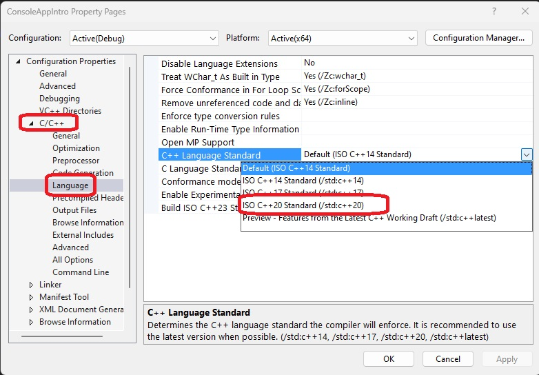
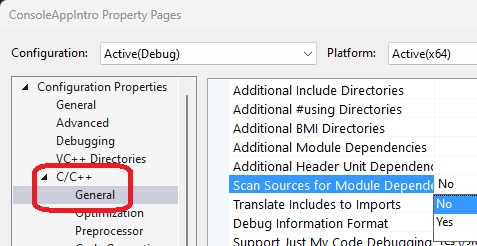

# Auto

## Notes
1. Fire up visual studio 



2. Select C++ Console Project and click Next(find it at bottom right).



3. First console app. Name the project, select location and click Create(find it at bottom right)



4. Console App in Visual Studio. Optionally you can rename the cpp file to main.cpp.



5. Change #include to import. Change the properties 



6. Choose cpp 20 as follows.



7. Also choose the following option



7. Build, run and debug.

8. Now Adding module. 

9. Ctrl + Shift + A or right click on the project, Add -> New Item.


10. Change the contents of the module file to the following.

```cpp
module;
//Global module fragment : #include , preprocessor directives
export module my_math_module;
//Module preamble: imports
import <iostream>;

//Module purview
export void say_something() {
	std::cout << "Saying something..." << std::endl;
}
```


## References

1. 

