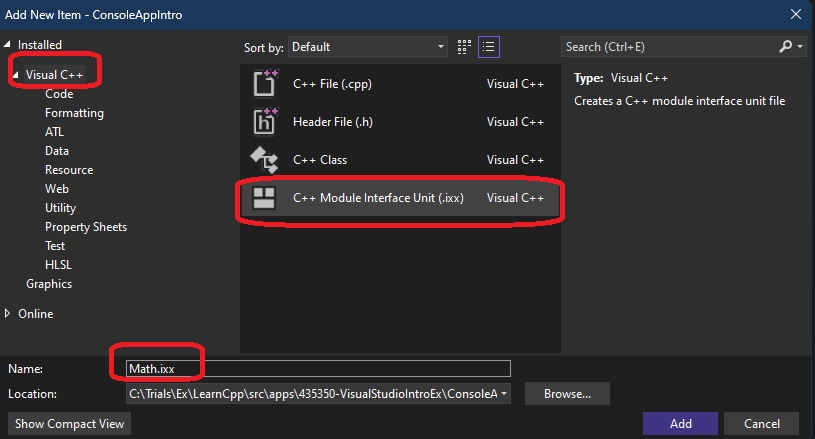

# Auto

## Notes
1. Now Adding module. In the earlier example, a VS project is created, we now add a module to it.

2. Ctrl + Shift + A or right click on the project, Add -> New Item.



3. Change the contents of the module file to the following.

```cpp
module;
//Global module fragment : #include , preprocessor directives
export module my_math_module;
//Module preamble: imports
import <iostream>;

//Module purview
export void say_something() {
	std::cout << "Hello World from Module..." << std::endl;
}
```

4. 

## References

1. 

