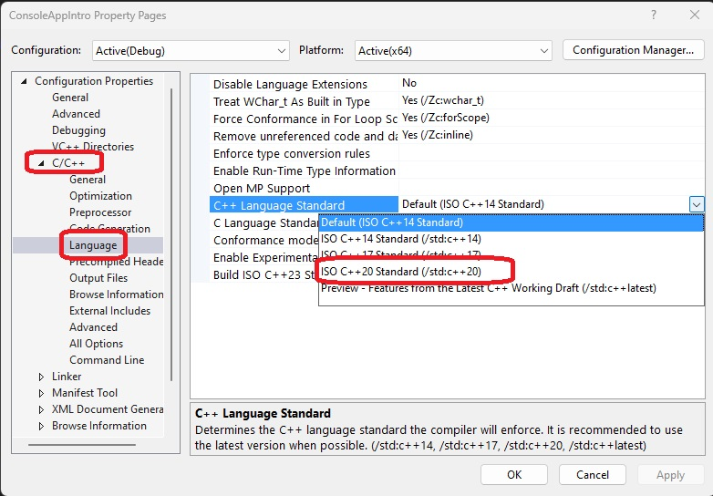
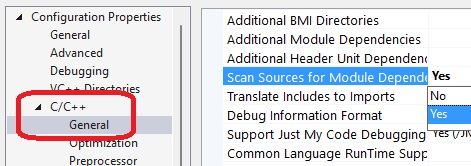

## Pre Req
1. An earlier example, CallCppDllFromCSharp.

## How the solution is built.
1. Follow CallCppDllFromCSharp and create CallCppModuleFromCSharp.
2. The CPP project must ensure the following.

   1. Choose cpp 20 as follows.

	

   2. Also choose yes for the following option

	

3. Add a module to the cpp project. See the `simple_module.ixx` file.

4. Ensure you have some header file, and then in that header file, you add the following. In this example, we have `calc.h` file. 

```cpp
extern "C" __declspec(dllexport) double MultiplyFromModule(double a, double b);
```

